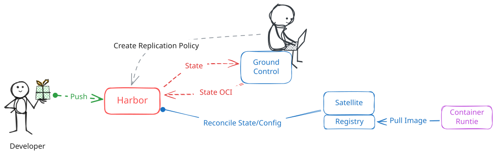
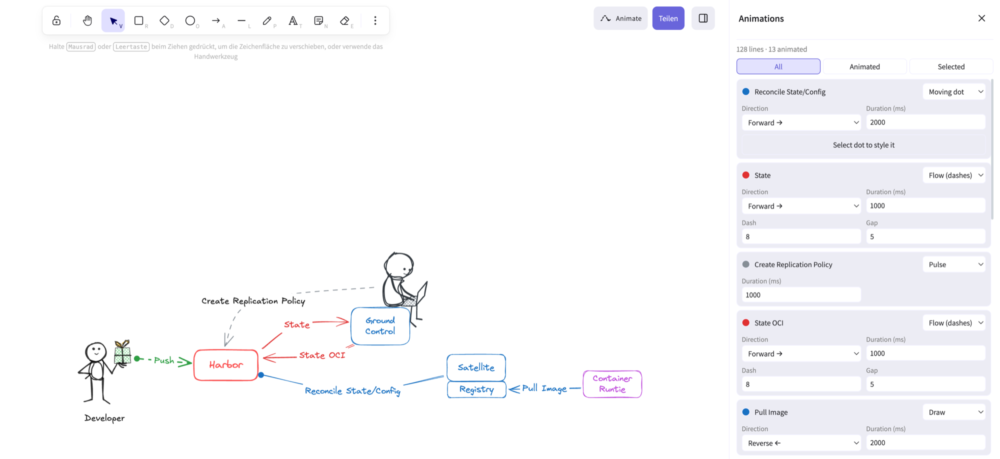
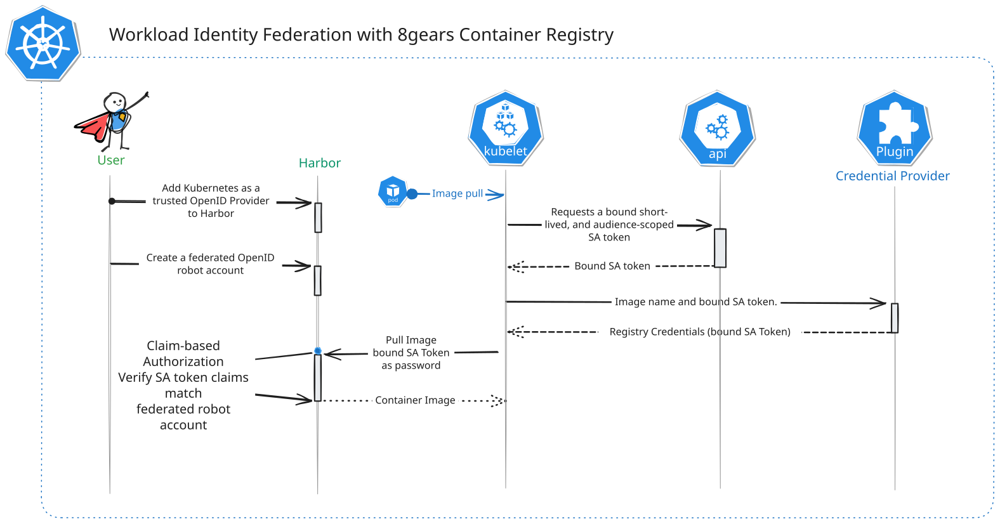

# Excalidraw Animate

**Animate the arrows and lines of your [Excalidraw](https://excalidraw.com) diagrams and export them as pure SVG animations.** No JavaScript, no video, no GIF, no runtime library. The result is a single `.svg` file that animates wherever SVG images are shown: in an `` tag, a GitHub README, docs sites, and slides.

**[Try it in the browser](https://8gears.github.io/excalidraw-animate/)** · **[Examples](https://8gears.github.io/excalidraw-animate/examples/)**



_The image above is the exported SVG itself, playing right here in the README._

## What it does

Excalidraw Animate is the Excalidraw editor with an **Animate** panel. Draw your diagram as usual, pick an animation for each arrow or line, and export.



- **Per-line control.** The Animations sidebar lists every arrow and line, labelled with its text. Each one gets its own animation, direction, and timing. Filter by _All_, _Animated_ or _Selected_; selecting an arrow on the canvas scrolls the list to it.
- **Four animation types:**

  | Animation | Effect | Settings |
  | --- | --- | --- |
  | Flow | Marching dashes along the line, like data or traffic moving | direction, duration, dash, gap |
  | Draw | The line draws itself, the arrowheads appear when it's complete | direction, duration |
  | Pulse | The line fades in and out | duration |
  | Moving dot | A dot travels along the line, like a packet or a request | direction, duration |

- **Directions:** forward, reverse, or alternate (back and forth). The default follows the arrowheads.
- **The moving dot is a real canvas element.** Choosing _Moving dot_ adds a small circle to the drawing that you can recolor, resize and restyle like any other shape. Delete it and the animation is disabled; undo brings it back. It passes under the arrow's label like the line does.
- **Hover reveal.** Optionally hide all text, or only the labels of animated arrows, until the pointer is over the diagram. Busy diagrams stay clean, details appear on demand.
- **Stays editable.** Animation settings are stored in the scene (`customData`), so they are saved in `.excalidraw` files, in exported `.excalidraw.svg` files with an embedded scene, in undo history, and in live collaboration. Re-open the file, change the drawing, export again.
- **Everything else is still Excalidraw:** hand-drawn style, libraries, collaboration, dark mode, PNG export.

## Pure SVG export

The export is a standard SVG file with [SMIL](https://developer.mozilla.org/en-US/docs/Web/SVG/Element/animate) animations (`<animate>`, `<animateMotion>`) added to the lines, the same file you get from Excalidraw plus a few elements:

```xml
<path d="…" stroke="#1971c2" stroke-dasharray="8 5">
  <animate attributeName="stroke-dashoffset" values="0;-13" dur="1000ms" repeatCount="indefinite"/>
</path>
```

What that means in practice:

- **No script.** Nothing executes, so it works where JavaScript is stripped or blocked, including GitHub READMEs and image tags.
- **Vector.** Crisp at any zoom level, text stays text, and the file is small. The examples here are 70 to 95 KiB (about 30 KiB gzipped) including the embedded handwriting fonts. A screen-recorded GIF of the same diagram would be far larger and blurry.
- **Supported by all current browsers:** Chrome, Edge, Firefox and Safari. Programs without SMIL support show the static diagram.
- **Optimize size.** _Preview & export_ can shrink the file (rounded coordinates, compact paths, unused masks removed) without touching the animations. The Workload Identity example below goes from 113 KiB to 87 KiB. Generic optimizers such as SVGO with default settings can drop animations; this one is built for them.
- **Hover reveal needs an interactive SVG.** It's CSS `:hover`, which works when the SVG is inline in a page or embedded with `<object>` / `<iframe>`, but not inside an `` tag or on touch screens. The examples in this README therefore have it turned off; the [examples page](https://8gears.github.io/excalidraw-animate/examples/) shows it working.

## Examples

**Harbor Satellite:** flow, draw, pulse and two moving dots. [Open it in the editor](https://8gears.github.io/excalidraw-animate/#url=https%3A%2F%2F8gears.github.io%2Fexcalidraw-animate%2Fexamples%2Fharbor-satellite.excalidraw.svg), change the animations, and export your own version.


**Workload Identity Federation with 8gears Container Registry:** a sequence diagram with its key requests animated.



The originals with Hover reveal enabled are in [`public/examples/`](public/examples/) and on the [examples page](https://8gears.github.io/excalidraw-animate/examples/).

## How is this different?

| Approach | Limitation | Excalidraw Animate |
| --- | --- | --- |
| Excalidraw's own export | Static images only | Same export, animated |
| [excalidraw-animate](https://github.com/dai-shi/excalidraw-animate) by dai-shi | Plays back how the drawing is drawn, element by element (order and duration per element), exported as SVG or WebM. Great for "sketching" reveals, but no looping flows or moving dots, and its animated SVG can't be edited again | Looping per-line animations that show what moves where, configured inside the editor, and the export stays editable |
| GIF or video screen recordings | Raster, large files, blurry text, not editable | Vector, small, the source stays an editable Excalidraw scene |
| Hand-written CSS or scripts on the exported SVG | Selectors break with every re-export, colors or element order used as proxies | Settings live on the elements and survive edits and re-exports |
| Animation tools (SVGator, Lottie, …) | Redraw the diagram in another tool; Lottie also needs a JavaScript player | Stay in Excalidraw, no player needed |

## Using it

**Online:** [8gears.github.io/excalidraw-animate](https://8gears.github.io/excalidraw-animate/). Your drawing stays in your browser's local storage, as with excalidraw.com.

1. Draw or open a diagram (you can drop an `.excalidraw` or `.excalidraw.svg` file onto the canvas).
2. Click **Animate** (top right) to open the Animations sidebar.
3. Choose an animation for each arrow or line, and tune direction and duration.
4. Click **Preview & export**, check the preview, then **Download SVG** or **Copy SVG**. Tick _Embed scene_ to keep the file editable.

**Locally:**

```bash
git clone https://github.com/8gears/excalidraw-animate.git
cd excalidraw-animate
yarn install
yarn start          # http://localhost:3001
```

`yarn test:app`, `yarn test:typecheck` and `yarn test:code` run the tests, type checks and lint.

## Relationship to Excalidraw

This is a fork of [excalidraw/excalidraw](https://github.com/excalidraw/excalidraw) that follows upstream closely. All animation code lives in [`packages/excalidraw/animation/`](packages/excalidraw/animation/); upstream files only get a few small, marked hooks, so upstream changes can be merged regularly. [FORK.md](FORK.md) lists every hook and the sync procedure.

For everything else about the editor, see the [Excalidraw documentation](https://docs.excalidraw.com).

## License

MIT, like Excalidraw. See [LICENSE](LICENSE).
